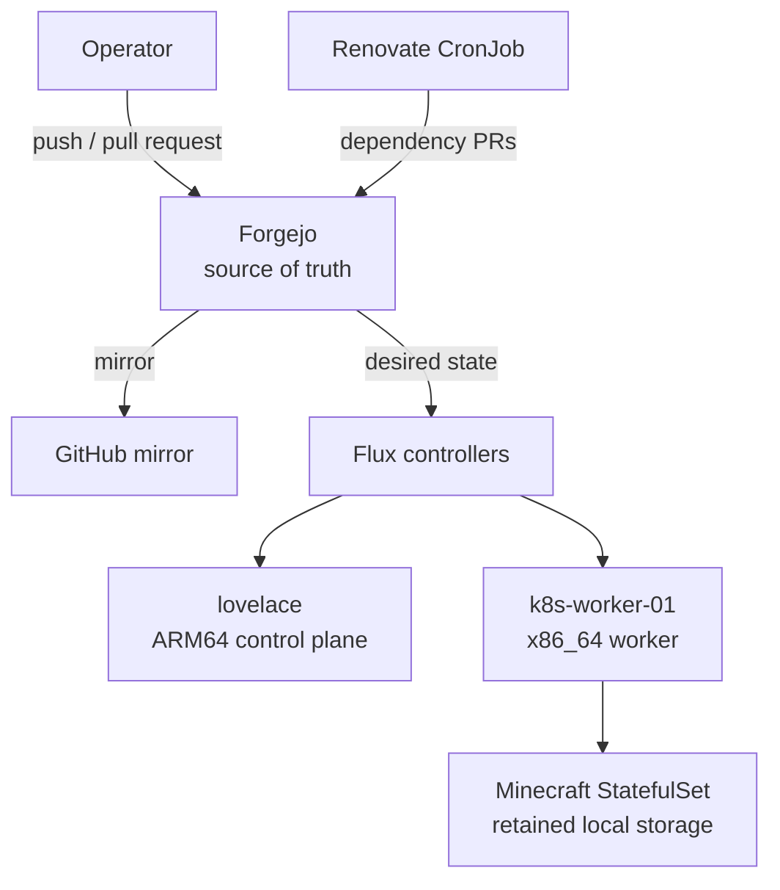

# Lovelace Cluster

Lovelace is a small, heterogeneous k3s cluster managed declaratively with Flux. A Raspberry Pi 5 provides the ARM64 control plane, while a Debian x86_64 worker hosts workloads that require x86 compatibility or dedicated local storage.

Forgejo is the primary Git service. Changes are reviewed through pull requests, merged into `main`, and reconciled into the cluster by Flux. GitHub is maintained as an external mirror.

## Architecture



| Component | Role |
| --- | --- |
| `lovelace` | Raspberry Pi 5, ARM64 k3s server/control plane |
| `k8s-worker-01` | Debian x86_64 k3s worker labeled `workload=minecraft` |
| Forgejo | Primary repository, pull requests, and GitOps source |
| GitHub | Push mirror for off-site visibility |
| Flux | Reconciles applications, infrastructure, and monitoring from `main` |
| SOPS + age | Encrypts Kubernetes Secret data committed to Git |

For the complete design, see [Architecture](docs/architecture.md).

## Managed workloads

| Workload | Namespace | Delivery | Storage | Exposure |
| --- | --- | --- | --- | --- |
| Audiobookshelf | `audiobookshelf` | Deployment | Four `local-path` PVCs | Traefik and Cloudflare Tunnel |
| Linkding | `linkding` | Deployment | One `local-path` PVC | Traefik and Cloudflare Tunnel |
| Minecraft Paper | `minecraft` | StatefulSet | Retained 60 GiB local PV on `k8s-worker-01` | Playit Tunnel |
| Renovate | `renovate` | Hourly CronJob | None | Forgejo API |
| kube-prometheus-stack | `monitoring` | Flux HelmRelease | Grafana is intentionally ephemeral | Traefik ingress |

See [Applications](docs/applications.md) for workload-specific details.

## Repository layout

```text
.
├── apps/
│   ├── base/                    # Reusable application resources
│   └── staging/                 # Cluster-specific overlays and encrypted secrets
├── clusters/staging/            # Flux entry points
├── infrastructure/controllers/  # Platform controllers such as Renovate
├── monitoring/
│   ├── controllers/             # Helm repositories and releases
│   └── configs/                 # ServiceMonitors and encrypted configuration
├── docs/                        # Architecture and operational documentation
├── CONTRIBUTING.md              # Change and validation workflow
└── renovate.json                # Renovate repository configuration
```

The `base` directories contain reusable manifests. The `staging` directories compose those resources and add environment-specific patches, storage, ingress, and encrypted secrets.

## Reconciliation flow

Flux bootstraps from `clusters/staging` and reconciles three primary areas:

| Flux Kustomization | Repository path | Purpose |
| --- | --- | --- |
| `apps` | `./apps/staging` | User-facing workloads |
| `infrastructure-controllers` | `./infrastructure/controllers/staging` | Supporting controllers and automation |
| `monitoring-controllers` | `./monitoring/controllers/staging` | Monitoring Helm releases |
| `monitoring-configs` | `./monitoring/configs/staging` | ServiceMonitors and encrypted monitoring configuration |

All four reconcile from the same Flux `GitRepository`. SOPS decryption is enabled only where encrypted manifests are consumed.

## Working with the repository

### Prerequisites

- Access to the Forgejo repository
- `git`
- `kubectl` configured for the Lovelace cluster
- `flux`
- `sops`
- Access to the age recipient for encryption; decryption keys remain in the cluster

### Make a change

```bash
git switch main
git pull --ff-only
git switch -c <type>/<short-description>
```

Edit the appropriate base or staging overlay, validate it, commit it, and open a Forgejo pull request. Flux deploys only after the change reaches `main`.

### Validate locally

```bash
kubectl kustomize apps/staging | kubectl apply --dry-run=client -f -
kubectl kustomize infrastructure/controllers/staging | kubectl apply --dry-run=client -f -
kubectl kustomize monitoring/controllers/staging | kubectl apply --dry-run=client -f -
kubectl kustomize monitoring/configs/staging | kubectl apply --dry-run=client -f -
git diff --check
```

Encrypted manifests should also report an encrypted status:

```bash
sops filestatus path/to/secret.sops.yaml
```

Expected result:

```json
{"encrypted":true}
```

## Documentation

- [Architecture](docs/architecture.md)
- [Applications](docs/applications.md)
- [GitOps workflow](docs/gitops-workflow.md)
- [Secrets management](docs/secrets.md)
- [Operations and recovery](docs/operations.md)
- [Monitoring and logging](docs/monitoring.md)
- [Minecraft](docs/minecraft.md)
- [Renovate](docs/renovate.md)
- [Contributing](CONTRIBUTING.md)

## Safety principles

- Git is the source of truth; avoid routine imperative changes to managed resources.
- Never commit plaintext credentials or decrypted SOPS output.
- Persistent Minecraft resources use both `Retain` and Flux prune protection.
- Inspect rendered manifests before merging.
- Treat node-bound local storage as non-portable and back it up independently.

## License

This repository is maintained as a personal infrastructure and learning project. No license is currently declared.