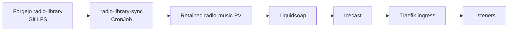

# Applications

## Audiobookshelf

Audiobookshelf runs as a single-replica Deployment in the `audiobookshelf` namespace.

Key characteristics:

- Application port `3005` sourced from a ConfigMap
- Non-root runtime using UID/GID `1000`
- Permission-fixing init container for mounted storage
- Separate PVCs for configuration, metadata, audiobooks, and podcasts
- ClusterIP Service and Traefik ingress
- Cloudflare Tunnel with SOPS-encrypted credentials

The four PVC requests are 1 GiB for configuration, 1 GiB for metadata, 20 GiB for audiobooks, and 10 GiB for podcasts.

## Linkding

Linkding runs as a single-replica Deployment in the `linkding` namespace.

Key characteristics:

- Application port `9090`
- Runtime UID/GID `33` (`www-data`)
- 1 GiB PVC mounted at `/etc/linkding/data`
- Superuser configuration supplied through a SOPS-encrypted Secret
- ClusterIP Service and Traefik ingress
- Cloudflare Tunnel with SOPS-encrypted credentials

## Minecraft

Minecraft is the cluster's primary game-server workload. It runs as a three-container pod managed by a StatefulSet:

| Container | Responsibility |
| --- | --- |
| `minecraft` | Paper server and Prometheus plugin endpoint |
| `storage-metrics-collector` | Periodic read-only scan of `/data` |
| `network-exporter` | Pod network and textfile metrics |

The staging overlay pins the pod to `k8s-worker-01`, increases resource allocation, injects encrypted private configuration, and binds a retained local PV. Public access is provided by a separate Playit Deployment.

See [Minecraft](minecraft.md) for operations and recovery.

## Radio

Radio runs in the `radio` namespace and is intentionally split into playback, streaming, storage, and content-reconciliation responsibilities.

| Component | Responsibility |
| --- | --- |
| `liquidsoap` Deployment | Random playlist selection, safe source handling, MP3 encoding, and Icecast source connection |
| `icecast` Deployment | HTTP audio stream server |
| `icecast` Service | Stable in-cluster endpoint on port 8000 |
| `radio-music` PV/PVC | Retained local repository checkout and published audio releases |
| `radio-library-sync` CronJob | Reconciles the external radio library every five minutes |
| `radio-library-sync` OCI image | Contains the tested reconciliation logic instead of installing tools at Job startup |
| `radio-library-ssh` Secret | Read-only Forgejo deploy key and known-hosts data |
| `radio-registry-auth` Secret | Read-only Forgejo OCI pull credential |
| public `radio-public-stream` Ingress | Exposes only the exact `/radio.mp3` stream path |
| internal `radio-stream` Ingress | Provides the same exact stream path on the lab hostname |

Liquidsoap reads `/music/current/music`, where `current` is an atomically replaced symlink to a validated immutable release. The sync process retains the current and immediately previous release and prunes older releases.

The content repository is separate from this cluster repository. Routine library management is done by adding, removing, or renaming files in `NovaLabs/radio-library` and pushing `main`. The CronJob then fetches the commit, verifies Git LFS objects, validates the published file count, and promotes the release without restarting Liquidsoap.

See [Radio](radio.md) for library management, verification, recovery, registry configuration, and image publishing.

## Renovate

Renovate runs hourly as a Kubernetes CronJob in the `renovate` namespace. It checks image tags and opens pull requests against Forgejo. Its API token is stored as a SOPS-encrypted Secret.

See [Renovate](renovate.md).

## Monitoring stack

The Prometheus community kube-prometheus-stack is installed through a Flux HelmRelease in `monitoring`. It supplies Prometheus Operator resources, Prometheus, Grafana, Alertmanager, and Kubernetes dashboards.

Grafana storage is intentionally ephemeral. Dashboards provisioned by the chart return after a pod restart; UI-created content should not be considered durable.

See [Monitoring](monitoring.md).
