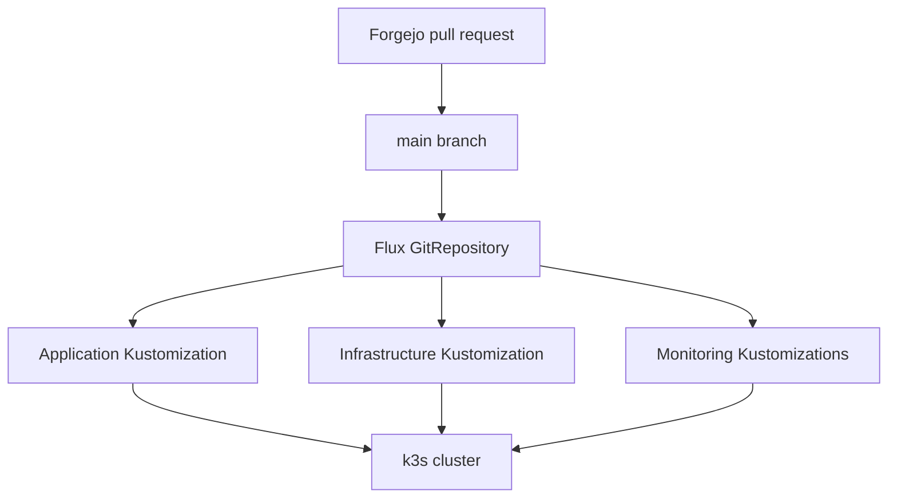
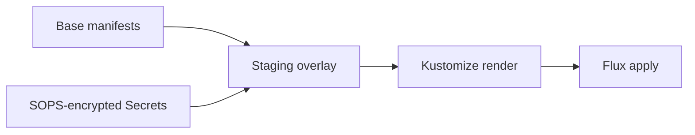

# Architecture

## Goals

Lovelace is designed as a compact production-style learning environment. It demonstrates declarative delivery, mixed-architecture scheduling, stateful workload management, encrypted configuration, dependency automation, and observability without hiding Kubernetes behind a platform UI.

## Cluster topology

| Node | Architecture | Operating system | Kubernetes role | Notable workloads |
| --- | --- | --- | --- | --- |
| `lovelace` | ARM64 | Debian on Raspberry Pi 5 | k3s server/control plane | Flux and general cluster services |
| `k8s-worker-01` | x86_64 | Debian VM | k3s agent/worker | Minecraft and its node-local data |

Minecraft selects the worker through:

```yaml
nodeSelector:
  workload: minecraft
```

The corresponding node label is applied operationally:

```bash
kubectl label node k8s-worker-01 workload=minecraft
```

## Control and delivery planes



Forgejo is authoritative. GitHub receives a push mirror, but GitHub pull requests and branches are not part of the deployment path.

## Network exposure

There are three distinct access patterns:

| Path | Purpose |
| --- | --- |
| Traefik ingress and `*.caliconet.lab` DNS | Private LAN access to HTTP applications |
| Cloudflare Tunnel | Public HTTPS access to selected web applications |
| Playit | Public Minecraft TCP access without exposing an inbound router port |

Kubernetes Services provide stable in-cluster discovery. Workloads should reference service DNS names, not ClusterIP addresses, because ClusterIPs may change when resources are recreated.

## Storage model

Audiobookshelf and Linkding use dynamically provisioned `local-path` PVCs. Their data follows the node-local behavior of the k3s local-path provisioner.

Minecraft uses a deliberately explicit storage design:

- Static 60 GiB PersistentVolume
- Host path `/srv/minecraft/data` on `k8s-worker-01`
- `minecraft-local` StorageClass with `WaitForFirstConsumer`
- PV node affinity for `k8s-worker-01`
- `persistentVolumeReclaimPolicy: Retain`
- Flux prune protection on both the PV and PVC

This protects the Kubernetes objects from routine pruning, but it is not a backup. The host directory must be backed up separately.

## Configuration hierarchy



Base manifests hold reusable workload definitions. Staging overlays add cluster-specific hostnames, credentials, resource sizing, node placement, and storage.

## Observability boundaries

The repository manages an in-cluster kube-prometheus-stack and a Minecraft `ServiceMonitor`. Minecraft logs are collected by Alloy and sent to the central Loki service on the Docker LXC.

The central Docker-LXC Prometheus, Grafana, Loki, and Alertmanager configuration is operationally related but stored outside this repository. External scrapes use the worker node address and host-published metrics ports. See [Monitoring](monitoring.md).

## Failure domains

- Loss of `lovelace` interrupts the Kubernetes API and Flux reconciliation.
- Loss of `k8s-worker-01` makes Minecraft unavailable because both workload placement and storage are tied to that node.
- Loss of Forgejo prevents new GitOps changes, but already-applied workloads continue running.
- Loss of the Docker LXC interrupts centralized dashboards, alerts, and Loki ingestion without stopping Minecraft itself.
- Loss of the Playit agent removes public Minecraft reachability while the internal server may remain healthy.