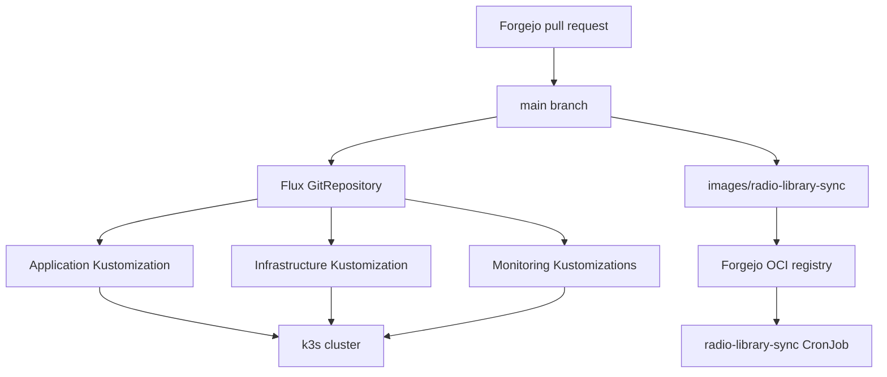
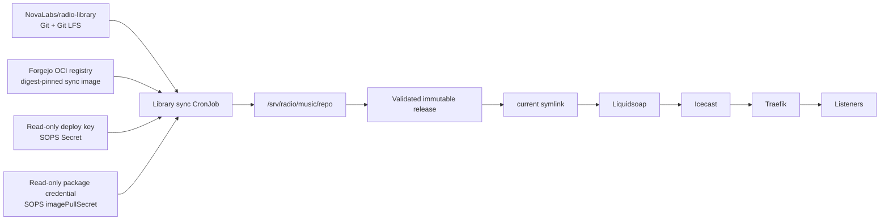
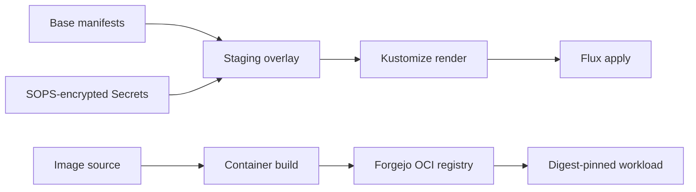

# Architecture

## Goals

Lovelace is designed as a compact production-style learning environment. It demonstrates declarative delivery, mixed-architecture scheduling, stateful workload management, encrypted configuration, dependency automation, private container distribution, content reconciliation, and observability without hiding Kubernetes behind a platform UI.

## Cluster topology

| Node | Architecture | Operating system | Kubernetes role | Notable workloads |
| --- | --- | --- | --- | --- |
| `lovelace` | ARM64 | Debian on Raspberry Pi 5 | k3s server/control plane | Flux and general cluster services |
| `k8s-worker-01` | x86_64 | Debian VM | k3s agent/worker | Minecraft, Radio, and their node-local data |

Minecraft selects the worker through a workload label. Radio is bound to the worker indirectly through the node affinity of its local PersistentVolume.

## Control and delivery planes



Forgejo is authoritative. GitHub receives a push mirror, but GitHub pull requests and branches are not part of the deployment path.

The radio subsystem adds a second form of desired state: the audio library itself lives in a separate Forgejo repository. Flux deploys the radio infrastructure, while a purpose-built CronJob reconciles the content repository onto persistent storage.



## Network exposure

There are four distinct access patterns:

| Path | Purpose |
| --- | --- |
| Traefik ingress and `*.caliconet.lab` DNS | Private LAN access to HTTP applications |
| Cloudflare Tunnel | Public HTTPS access to selected web applications |
| Playit | Public Minecraft TCP access without exposing a direct game-server port |
| Traefik exact-path public ingress | Public radio stream at `/radio.mp3` without exposing the Icecast admin surface |

Kubernetes Services provide stable in-cluster discovery. Workloads should reference service DNS names, not ClusterIP addresses, because ClusterIPs may change when resources are recreated.

The public radio ingress exposes only the exact `/radio.mp3` path. Icecast administration is intentionally not published through that ingress.

## Storage model

Audiobookshelf and Linkding use dynamically provisioned `local-path` PVCs. Their data follows the node-local behavior of the k3s local-path provisioner.

Minecraft uses a deliberately explicit storage design:

- Static retained local PersistentVolume
- Host path on `k8s-worker-01`
- Dedicated StorageClass
- PV node affinity for `k8s-worker-01`
- `persistentVolumeReclaimPolicy: Retain`
- Flux prune protection on persistent resources

Radio uses the same principle for its media library:

- 60 GiB static local PersistentVolume
- Host path `/srv/radio/music`
- `radio-local` StorageClass
- PV node affinity for `k8s-worker-01`
- `persistentVolumeReclaimPolicy: Retain`
- Flux prune protection on the PV and PVC
- Repository checkout, immutable releases, and the live `current` symlink all live on the same filesystem

The radio filesystem is intentionally structured as:

```text
/srv/radio/music/
├── repo/                  # Persistent Git + Git LFS checkout
├── releases/
│   ├── <previous-sha>/    # One-generation rollback copy
│   └── <current-sha>/     # Current validated release
├── current -> releases/<current-sha>
└── .radio-library-sync.lock
```

These retention mechanisms protect Kubernetes objects and support fast operational recovery, but they are not backups. Node-local data must be backed up independently.

## Radio atomic publication

The library reconciler does not update the files Liquidsoap is actively reading in place.

```mermaid
sequenceDiagram
    participant G as Forgejo radio-library
    participant C as Sync CronJob
    participant R as Repository checkout
    participant N as New release
    participant P as current symlink
    participant L as Liquidsoap

    C->>C: Acquire filesystem lock
    C->>G: Fetch origin/main
    C->>R: Reset checkout to target commit
    C->>R: git lfs pull + git lfs fsck
    C->>N: Copy complete library
    C->>N: Validate tracked count == published count
    C->>P: Atomically replace symlink
    L->>P: Reload playlist
    C->>C: Keep current + previous; prune older releases
```

The reconciler uses both Kubernetes `concurrencyPolicy: Forbid` and a filesystem `flock`. The Kubernetes policy prevents normal scheduled overlap; the filesystem lock also protects against a manually-created Job racing the scheduled Job.

Liquidsoap reads `/music/current/music` and reloads its playlist every 60 seconds. A library update therefore does not require a Deployment restart.

## Private OCI registry

The purpose-built `radio-library-sync` image is stored in Forgejo's OCI registry and referenced by immutable SHA-256 digest from the CronJob.

The registry currently uses an internal HTTP endpoint. Two node-local runtime configurations are therefore important:

- Docker build hosts must allow the Forgejo registry as an insecure registry before pushing.
- k3s/containerd on the worker must map the Forgejo registry to its HTTP endpoint in `/etc/rancher/k3s/registries.yaml`.

Kubernetes authenticates image pulls through the SOPS-encrypted `radio-registry-auth` Secret. The credential should have package read access only. Image publishing uses a separate package write credential.

## Configuration hierarchy



Base manifests hold reusable workload definitions. Staging overlays add cluster-specific hostnames, credentials, resource sizing, node placement, storage, TLS, and private-registry authentication.

## Observability boundaries

The repository manages an in-cluster kube-prometheus-stack and Minecraft monitoring resources. Minecraft logs are collected by Alloy and sent to the central Loki service on the Docker LXC.

The central Docker-LXC Prometheus, Grafana, Loki, and Alertmanager configuration is operationally related but stored outside this repository.

Radio observability is currently operational rather than fully dashboarded. Kubernetes Job status, Liquidsoap logs, Icecast state, and filesystem state are the primary troubleshooting surfaces. A dedicated Grafana view can be layered on later without changing the radio delivery architecture.

See [Monitoring](monitoring.md) and [Radio](radio.md).

## Failure domains

- Loss of `lovelace` interrupts the Kubernetes API and Flux reconciliation.
- Loss of `k8s-worker-01` makes Minecraft and Radio unavailable because their stateful storage is tied to that node.
- Loss of the Radio storage device removes the content repository checkout, published releases, and active library path even if Kubernetes remains healthy.
- Loss of Forgejo prevents new GitOps and radio-library changes, but already-applied workloads and the current published radio release continue running.
- Loss of the Forgejo OCI registry prevents uncached pulls of the radio sync image; an already-running radio stream continues.
- Loss of the Docker LXC interrupts centralized dashboards, alerts, and Loki ingestion without stopping Minecraft or Radio themselves.
- Loss of the Playit agent removes public Minecraft reachability while the internal server may remain healthy.
- Loss of public HTTPS routing removes external radio reachability while Icecast and Liquidsoap may remain healthy inside the cluster.
