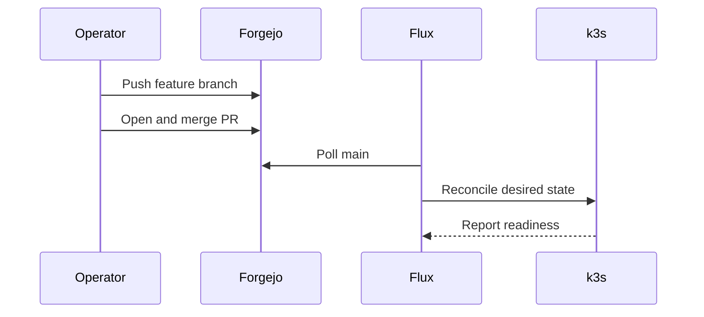

# GitOps Workflow

## Source of truth

Forgejo hosts the primary `NovaLabs/lovelace-cluster` repository. The `main` branch represents the desired cluster state. GitHub is a push mirror and is not used for deployment decisions.



## Branch and pull-request flow

Create one focused branch per change:

```bash
git switch main
git pull --ff-only
git switch -c <type>/<short-description>
```

Common branch prefixes include `feat/`, `fix/`, `docs/`, and `chore/`.

Before committing:

```bash
git diff --check
kubectl kustomize <changed-overlay> | kubectl apply --dry-run=client -f -
```

After review, merge the pull request in Forgejo. The branch may then be deleted. The GitHub mirror receives the updated branch state according to its configured mirror schedule.

## Flux entry points

The manifests under `clusters/staging` define the reconciliation boundaries:

- `apps.yaml`
- `infrastructure.yaml`
- `monitoring.yaml`
- `flux-system/`

Do not edit generated Flux bootstrap components casually. Application and platform changes normally belong under `apps`, `infrastructure`, or `monitoring`.

## Reconciliation behavior

The primary Flux Kustomizations reconcile every minute, retry every minute, and use a five-minute timeout. Pruning is enabled generally, with explicit protection on the Minecraft PV and PVC.

Inspect status:

```bash
flux get sources git -A
flux get kustomizations -A
flux get helmreleases -A
```

Request an immediate reconciliation:

```bash
flux reconcile source git flux-system -n flux-system
flux reconcile kustomization apps --with-source
```

Use the matching Kustomization name for infrastructure or monitoring changes.

## Drift

Flux continuously restores the declared state. Imperative edits made with `kubectl edit`, `kubectl patch`, or direct `kubectl apply` may be reverted at the next reconciliation.

Use imperative commands for inspection and carefully scoped diagnostics. Make durable changes in Git.

## GitHub mirror behavior

The mirror reflects Forgejo's Git references. A mirror is not bidirectional collaboration:

- Merge changes in Forgejo.
- Run Renovate against Forgejo.
- Do not rely on GitHub-only PRs or branches; mirror pruning can close or remove them.
- Use GitHub for visibility and an additional remote copy, not as a competing source of truth.