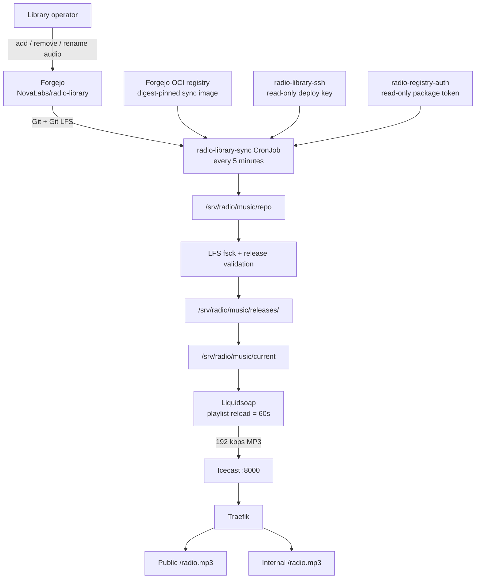
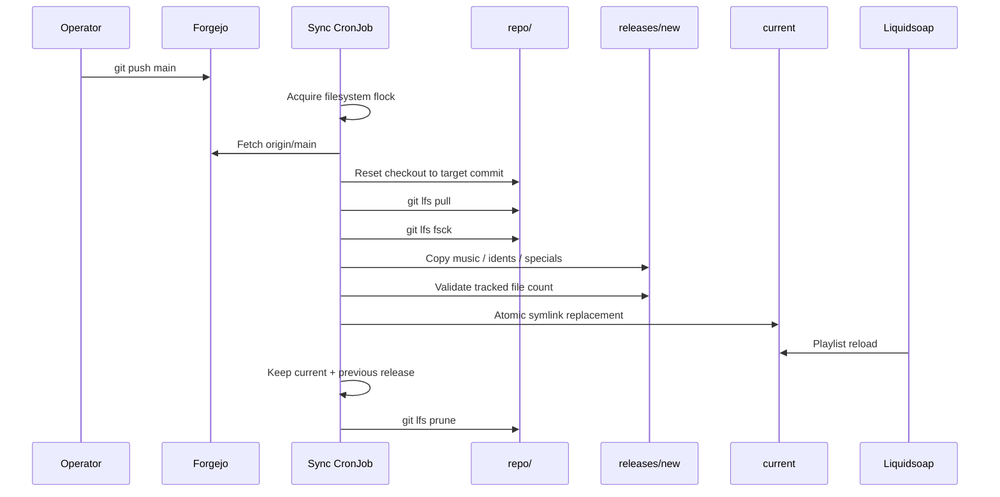

# Radio

## Purpose

The Radio application provides one continuous online station from the Lovelace cluster. All listeners hear the same Icecast source. Music selection and encoding are handled by Liquidsoap, while Icecast serves the stream.

The infrastructure is GitOps-managed in this repository. The audio library is managed separately in the Forgejo `NovaLabs/radio-library` repository using Git LFS.

Public stream:

```text
https://radio.caliconet.ca/radio.mp3
```

Internal stream:

```text
https://lovelace-radio.caliconet.lab/radio.mp3
```

Both ingress objects expose the exact `/radio.mp3` path. The public ingress does not expose the Icecast admin path.

## Architecture



## Kubernetes resources

The radio resources are under:

```text
apps/base/radio/
apps/staging/radio/
images/radio-library-sync/
```

Important objects:

| Object | Purpose |
| --- | --- |
| Namespace `radio` | Application boundary |
| Deployment `liquidsoap` | Playlist, encoding, Icecast source |
| ConfigMap `liquidsoap-config` | Liquidsoap program |
| Deployment `icecast` | Stream server |
| Service `icecast` | Cluster-local port 8000 |
| PVC/PV `radio-music` | Persistent radio filesystem |
| CronJob `radio-library-sync` | Content reconciliation every five minutes |
| Secret `icecast-auth` | Source, relay, and admin credentials |
| Secret `radio-library-ssh` | Read-only Forgejo deploy key and known-hosts data |
| Secret `radio-registry-auth` | Read-only Forgejo OCI registry credential |
| Secret `radio-tls-secret` | Internal TLS material |
| Certificate `radio-public` | cert-manager production certificate for the public stream |
| Ingress `radio-stream` | Internal exact-path stream |
| Ingress `radio-public-stream` | Public exact-path stream |

All Secret manifests committed to this public repository must remain SOPS-encrypted.

## Playback configuration

Liquidsoap currently:

- reads `/music/current/music`
- selects tracks randomly
- reloads the playlist every 60 seconds
- wraps the playlist in `mksafe`
- encodes MP3 at 192 kbps
- publishes to Icecast at `/radio.mp3`

The stable `current` path is important. Library synchronization never modifies the directory Liquidsoap is actively reading in place.

## Radio library repository

The content repository is:

```text
NovaLabs/radio-library
```

Current layout:

```text
radio-library/
├── music/       # Normal rotation
├── idents/      # Station IDs / bumpers; reserved for later scheduling logic
├── specials/    # Special programming; reserved for later scheduling logic
└── .gitattributes
```

Audio files are stored through Git LFS rather than normal Git blobs. The repository tracks the common station audio formats with LFS.

### Routine library management

From an existing checkout of `radio-library`:

```bash
git switch main
git pull --ff-only origin main

# Add, remove, or rename files under music/.
# Use normal filesystem tools or the file manager.

git add .
git status
git commit -m "library: update music rotation"
git push
```

The sync CronJob follows only `origin/main`. A push to another branch does not change the live station until that change reaches `main`.

For added audio, verify that Git LFS sees the files:

```bash
git lfs ls-files
```

Do not manually copy new music into `/srv/radio/music/current`. Git is the source of truth for the library.

## What happens after a push



If the library commit has not changed, the fast path exits with:

```text
Library already current at <commit>
```

No audio is recopied.

## Atomic release model

Host filesystem:

```text
/srv/radio/music/
├── repo/
│   ├── .git/
│   │   └── lfs/
│   └── music/
├── releases/
│   ├── <previous-commit>/
│   │   └── music/
│   └── <current-commit>/
│       └── music/
├── current -> releases/<current-commit>
└── .radio-library-sync.lock
```

The reconciler:

1. locks the entire shared radio filesystem with `flock`
2. fetches the desired library commit
3. materializes and verifies Git LFS content
4. copies a complete temporary release
5. confirms the tracked and published music-file counts match
6. atomically replaces `current`
7. keeps the current and immediately previous release
8. prunes older release directories and unneeded LFS objects

`concurrencyPolicy: Forbid` prevents normal CronJob overlap. The filesystem lock additionally protects against a manually-created Job racing a scheduled Job.

## Checking sync status

Show the CronJob:

```bash
kubectl -n radio get cronjob radio-library-sync
```

Show recent Jobs:

```bash
kubectl -n radio get jobs --sort-by=.metadata.creationTimestamp
```

Show the newest sync Job:

```bash
JOB=$(kubectl -n radio get jobs \
  -l app=radio-library-sync \
  --sort-by=.metadata.creationTimestamp \
  -o jsonpath='{.items[-1].metadata.name}')

echo "$JOB"
kubectl -n radio logs "job/$JOB"
```

Normal unchanged-library output is short:

```text
Acquired radio library reconciliation lock.
From ssh://forgejo.caliconet.lab:2222/NovaLabs/radio-library
 * branch            main       -> FETCH_HEAD
Library already current at <commit>
```

A changed library additionally reports the target commit, Git LFS validation, tracked/published counts, and the new `current` target.

## Force a reconciliation

Normally, wait for the five-minute schedule. For an immediate test:

```bash
JOB="radio-library-sync-manual-$(date +%s)"

kubectl -n radio create job \
  --from=cronjob/radio-library-sync \
  "$JOB"

kubectl -n radio logs -f "job/$JOB"
```

A manual Job may start at the same time as a scheduled Job. This is safe: the filesystem lock allows one reconciler to proceed while the other exits cleanly.

Delete a one-off test Job afterward if desired:

```bash
kubectl -n radio delete job "$JOB" --ignore-not-found
```

## Verify the published library

Filesystem checks must be run on `k8s-worker-01`, because the local PV exists there.

```bash
readlink /srv/radio/music/current
ls -1 /srv/radio/music/releases
find /srv/radio/music/current/music -type f | wc -l
df -h /srv/radio
```

Expected behavior:

- `current` points to `releases/<full-commit-sha>`
- the current release contains the desired track count
- normally two release directories exist after at least two successful library versions: current and previous

Do not run cluster `kubectl` commands from the worker unless kubeconfig is explicitly configured there. Use `lovelace` for normal Kubernetes and Flux commands.

## Verify Liquidsoap

Check that the Deployment is healthy:

```bash
kubectl -n radio get pods -l app=liquidsoap
```

When a rollout has recently occurred, avoid `kubectl logs deployment/liquidsoap` if more than one pod still exists, because Kubernetes may select an older pod. Select the newest pod explicitly:

```bash
NEWPOD=$(kubectl -n radio get pods \
  -l app=liquidsoap \
  --sort-by=.metadata.creationTimestamp \
  -o jsonpath='{.items[-1].metadata.name}')

kubectl -n radio logs "$NEWPOD" --since=10m |
grep -E 'Initial load|Reloading playlist|Prepared|current'
```

The active configuration should reference:

```text
/music/current/music
```

A normal library update should not restart Liquidsoap. The pod name/start time should remain stable and its restart count should remain unchanged.

## Deleted tracks and the Liquidsoap queue

Liquidsoap may already have queued a filename from the previous library when `current` switches to a new release.

If that track was deleted, a one-time message such as this can appear:

```text
Nonexistent file or ill-formed URI "/music/current/music/<deleted-track>"
```

That is not a station restart. The old filename was queued before the atomic switch. `mksafe` allows the source to continue, and the next playlist reload uses the new library.

## Rollback

The normal rollback mechanism is Git, not manual filesystem manipulation.

Revert the bad content commit in `radio-library` and push the revert to `main`:

```bash
git switch main
git pull --ff-only origin main
git revert <bad-library-commit>
git push
```

The CronJob sees the new commit, creates a validated release from the reverted tree, and atomically publishes it.

The immediately previous physical release is retained as operational insurance, but a manual symlink rollback will be overwritten by the next reconciliation because Forgejo `main` remains the desired state. Use a Git revert for durable rollback.

## Storage and recovery

The radio PV:

- requests 60 GiB
- uses the `radio-local` StorageClass
- maps to `/srv/radio/music`
- has node affinity for `k8s-worker-01`
- uses `persistentVolumeReclaimPolicy: Retain`
- has Flux prune protection on the persistent resources

The physical filesystem is node-local and non-portable. PV retention is not a backup.

Useful checks on the worker:

```bash
df -h /srv/radio
du -sh /srv/radio/music/repo
du -sh /srv/radio/music/releases/*
```

The persistent repository is intentionally larger than the live music tree because it contains both the Git working tree and the Git LFS object cache. Published releases consume additional space.

## Secrets

| Secret | Minimum privilege / purpose |
| --- | --- |
| `icecast-auth` | Icecast source, relay, and admin credentials |
| `radio-library-ssh` | Read-only SSH deploy key for `NovaLabs/radio-library` |
| `radio-registry-auth` | Read-only Forgejo package/OCI credential |
| `radio-tls-secret` | Internal TLS material |

Never commit plaintext versions of these files.

To encrypt a new or replaced radio Secret using the staging SOPS policy:

```powershell
sops `
  --config .\clusters\staging\.sops.yaml `
  --encrypt `
  --in-place `
  .\apps\staging\radio\<secret>.sops.yaml
```

Verify the secret value is visibly `ENC[...]` and a `sops:` metadata block exists before staging it.

## Library sync container image

Source:

```text
images/radio-library-sync/
├── Dockerfile
└── sync.sh
```

The image contains Git, Git LFS, OpenSSH, `flock`, and the reconciliation script. The CronJob therefore starts directly into reconciliation instead of downloading and installing packages every five minutes.

The workload is pinned by digest rather than a mutable tag.

### Rebuild and publish a new sync image

Build from the image directory on a Docker-capable host:

```bash
docker build \
  -t forgejo.caliconet.lab:3002/novalabs/lovelace-cluster/radio-library-sync:<version> \
  .
```

Run a basic entrypoint test with an empty temporary library:

```bash
TESTDIR=$(mktemp -d)

docker run --rm \
  -v "$TESTDIR:/library" \
  forgejo.caliconet.lab:3002/novalabs/lovelace-cluster/radio-library-sync:<version>

rm -rf "$TESTDIR"
```

The expected failure is:

```text
Acquired radio library reconciliation lock.
ERROR: /library/repo is not a valid Git checkout
```

That confirms the entrypoint, shell line endings, and `flock` work.

Authenticate to Forgejo using a separate package **read/write** token. Do not place the token directly on the command line:

```bash
read -rsp "Forgejo token: " FORGEJO_TOKEN
echo

printf '%s' "$FORGEJO_TOKEN" |
  docker login forgejo.caliconet.lab:3002 \
    --username <forgejo-user> \
    --password-stdin

unset FORGEJO_TOKEN
```

Push:

```bash
docker push \
  forgejo.caliconet.lab:3002/novalabs/lovelace-cluster/radio-library-sync:<version>
```

Record the returned `sha256:` digest, then update `apps/staging/radio/library-sync-cronjob.yaml` to the new digest through the normal pull-request workflow.

After publishing, log out if the build host does not need persistent registry credentials:

```bash
docker logout forgejo.caliconet.lab:3002
```

The package-write credential used for publishing should be separate from the package-read credential used by Kubernetes.

## Forgejo registry transport configuration

The Forgejo registry currently listens over HTTP on the internal registry endpoint.

### Docker build host

Docker must permit the registry as an insecure registry:

```json
{
  "insecure-registries": [
    "forgejo.caliconet.lab:3002"
  ]
}
```

Validate before restarting Docker:

```bash
sudo dockerd --validate --config-file=/etc/docker/daemon.json
```

### k3s worker

k3s/containerd requires:

```yaml
# /etc/rancher/k3s/registries.yaml
mirrors:
  "forgejo.caliconet.lab:3002":
    endpoint:
      - "http://forgejo.caliconet.lab:3002"
```

After changing this file:

```bash
sudo systemctl restart k3s-agent
```

Then verify from the control plane:

```bash
kubectl get nodes
```

The worker should return `Ready`.

Containerd transport configuration and Kubernetes registry authentication are separate concerns:

- `registries.yaml` tells containerd to use HTTP for this registry
- `radio-registry-auth` supplies package-read authentication to the Pod

## Public TLS and ingress

The public stream uses a cert-manager `Certificate` issued by the production Let's Encrypt `ClusterIssuer`.

Public ingress:

```text
radio.caliconet.ca
exact path: /radio.mp3
```

Internal ingress:

```text
lovelace-radio.caliconet.lab
exact path: /radio.mp3
```

Because both paths are exact, adding a public stream ingress does not automatically publish `/admin/` or the rest of the Icecast interface.

## Troubleshooting quick reference

### CronJob does not run

```bash
kubectl -n radio get cronjob radio-library-sync
kubectl -n radio get jobs --sort-by=.metadata.creationTimestamp
```

Confirm `SUSPEND` is `False`.

### ImagePullBackOff

Check Pod events:

```bash
kubectl -n radio describe pod <pod-name>
```

Common causes:

- worker missing `/etc/rancher/k3s/registries.yaml`
- registry transport attempting HTTPS instead of HTTP
- missing/invalid `radio-registry-auth`
- package token no longer has read access

### Library sync exits immediately

If another reconciliation already holds the lock, the expected message is:

```text
Radio library reconciliation already in progress; exiting.
```

This is a successful safety path, not an error.

### Release validation failed

Inspect the Job logs. The reconciler deliberately refuses promotion if the Git-tracked music count and prepared release count differ.

The existing `current` release remains in service when validation fails.

### Stream is running but library seems old

Check on `k8s-worker-01`:

```bash
readlink /srv/radio/music/current
```

Then compare that commit with the latest `radio-library` `main` commit and check the newest sync Job logs.

### Liquidsoap is healthy but one removed track errors once

This can happen when the filename was queued before the atomic release switch. Confirm the pod did not restart and wait for the next playlist reload.

## Planned extensions

The current library-management and publication path is complete. Future radio work can layer on top of it without changing the content deployment contract:

- richer Liquidsoap scheduling and crossfades
- station IDs and weighted pools
- live-DJ override
- dedicated radio metrics and Grafana dashboard
- internal-only Icecast administration ingress
- automated CI build/publish for `radio-library-sync`
